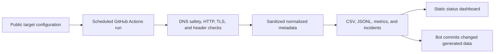

# Portfolio Ops

Repository: <https://github.com/spicyital/portfolio-ops>

[](https://github.com/spicyital/portfolio-ops/actions/workflows/ci.yml)
[](https://github.com/spicyital/portfolio-ops/actions/workflows/daily-monitor.yml)

Portfolio Ops is a small, privacy-first monitoring project for publicly accessible portfolio services. It checks each configured URL four times per day, records concise public metadata, and keeps a version-controlled history that is easy to inspect.

> **This repository monitors only publicly accessible URLs. It does not access WRepo source code, databases, student submissions, personal information, authenticated pages, or private infrastructure.**

## Current status

See the [current public-service status](data/status-summary.md). No uptime percentage is claimed until live daily monitoring has produced sufficient history.

## Reliability platform

Portfolio Ops now combines public availability checks with DNS safety checks, TLS-expiry metadata, security-header posture, bounded in-memory content assertions, latency analytics, incident state tracking, and a generated static dashboard in `site/`. It runs at **00:17, 06:17, 12:17, and 18:17 UTC**. Detailed metadata is retained for 90 days in JSON Lines; compatibility CSV and aggregate metrics remain version controlled.

The dashboard is generated locally with `python -m portfolio_ops.cli build-dashboard` and deployed by the GitHub Pages workflow. It has no analytics, cookies, external fonts, or authentication.

### Public monitoring methodology

This project observes public endpoints at scheduled intervals. It does not prove continuous uptime and does not access private application data. A target must be credential-free HTTP(S), have a valid public hostname, and resolve to at least one globally routable address before its HTTP request is made. Content assertions are capped at 256 KB and are inspected only in memory; page content is never saved.

## Architecture



The monitor uses Python's standard library and stores only the UTC date/time, sanitized public URL, target name, HTTP status, elapsed milliseconds, success flag, and a short error category. It does not retain a page body, cookies, headers, credentials, identifiers, or infrastructure information. See [architecture](docs/architecture.md) and [privacy](docs/privacy.md).

## Quickstart

Python 3.11+ is required.

```bash
python -m pip install -e ".[dev]"
python -m portfolio_ops.cli check
python -m portfolio_ops.cli show-latest
python -m portfolio_ops.cli incidents
python -m portfolio_ops.cli build-dashboard
```

The default target is `https://wrepo.net`. For local target changes, copy `config/targets.example.json` to `config/targets.json`; it is intentionally ignored by Git.

```bash
python -m portfolio_ops.cli check --config config/targets.json
python -m portfolio_ops.cli summary
python -m portfolio_ops.cli --help
```

## GitHub Actions

`daily-monitor.yml` runs at 00:17, 06:17, 12:17, and 18:17 UTC and can also be launched from **Actions > Daily public-service monitor > Run workflow**. It tests the package first, uses the standard `GITHUB_TOKEN`, and creates `chore(monitor): record daily public-service status` only when generated status data differs.

To enable automated pushes and incident alerts, go to **Settings > Actions > General > Workflow permissions** and select **Read and write permissions**. The monitoring workflow declares `contents: write` and `issues: write`; no personal access token is used. Ensure the default branch's protection rules allow GitHub Actions to push, or allow that bot in the rule.

Add production targets through the repository variable `MONITOR_TARGETS_JSON`; details and the Chrome Web Store example are in [adding targets](docs/adding-targets.md). A future Impact extension listing is treated strictly as a public availability page.

GitHub issue alerting is optional and runs only in Actions when `--issue-alerts` is supplied. It uses the built-in `GITHUB_TOKEN`, creates an issue only after the configured failure threshold, and closes the matching issue after two recovery checks. Enable GitHub Pages in **Settings > Pages > Build and deployment > GitHub Actions** to publish the dashboard.

## Data and status reporting

`data/uptime.csv` is the historical record. Example:

```csv
utc_date,checked_at,target_name,url,status_code,response_time_ms,success,error_type
2026-07-13,2026-07-13T03:17:00Z,wrepo,https://wrepo.net,200,143,true,
```

`data/latest-status.json` contains the newest result for each target, while `data/status-summary.md` reports current status and 7-/30-day success rates only after enough daily history exists. These records describe observations, not a guaranteed uptime claim.

`data/checks.jsonl` is created after the first detailed check and contains only sanitized measurement metadata. `data/service-metrics.json` and `data/incidents.json` contain machine-readable aggregates and incident state. 24-hour, 7-day, and 30-day rates remain `null`/insufficient until the observation period is represented; they are observed availability, never an SLA.

## Testing

```bash
ruff format --check .
ruff check .
pytest
python -c "import portfolio_ops"
python -m portfolio_ops.cli --help
```

All network access is mocked in tests. Coverage includes successful responses, redirect behavior, HTTP errors, timeouts, DNS/connection failures, malformed configuration, atomic CSV creation, historic-row preservation, duplicate prevention, latest-status generation, multiple targets, and Chrome Web Store-style URLs.

## Privacy and limitations

Portfolio Ops never accesses WRepo's private source repository, databases, authenticated pages, submissions, student records, user accounts, internal APIs, or non-public information. It never uses production secrets or stores page contents.

See [security](docs/security.md), [incidents](docs/incidents.md), [dashboard](docs/dashboard.md), and [operations](docs/operations.md) for the operating model.

It is intentionally a lightweight scheduled public-endpoint signal, not a synthetic transaction monitor, performance benchmark, or uptime SLA. A failed check can reflect a temporary network path issue and does not diagnose the target.
