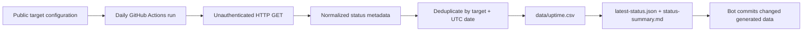

# Portfolio Ops

Repository: <https://github.com/spicyital/portfolio-ops>

[](https://github.com/spicyital/portfolio-ops/actions/workflows/ci.yml)
[](https://github.com/spicyital/portfolio-ops/actions/workflows/daily-monitor.yml)

Portfolio Ops is a small, privacy-first monitoring project for publicly accessible portfolio services. It checks each configured URL once per day, records a concise availability result, and keeps a version-controlled history that is easy to inspect.

> **This repository monitors only publicly accessible URLs. It does not access WRepo source code, databases, student submissions, personal information, authenticated pages, or private infrastructure.**

## Current status

See the [current public-service status](data/status-summary.md). No uptime percentage is claimed until live daily monitoring has produced sufficient history.

## Architecture



The monitor uses Python's standard library and stores only the UTC date/time, sanitized public URL, target name, HTTP status, elapsed milliseconds, success flag, and a short error category. It does not retain a page body, cookies, headers, credentials, identifiers, or infrastructure information. See [architecture](docs/architecture.md) and [privacy](docs/privacy.md).

## Quickstart

Python 3.11+ is required.

```bash
python -m pip install -e ".[dev]"
python -m portfolio_ops.cli check
python -m portfolio_ops.cli show-latest
```

The default target is `https://wrepo.net`. For local target changes, copy `config/targets.example.json` to `config/targets.json`; it is intentionally ignored by Git.

```bash
python -m portfolio_ops.cli check --config config/targets.json
python -m portfolio_ops.cli summary
python -m portfolio_ops.cli --help
```

## GitHub Actions

`daily-monitor.yml` runs at 03:17 UTC daily and can also be launched from **Actions → Daily public-service monitor → Run workflow**. It tests the package first, uses the standard `GITHUB_TOKEN`, and creates `chore(monitor): record daily public-service status` only when generated status data differs.

To enable automated pushes, go to **Settings → Actions → General → Workflow permissions** and select **Read and write permissions**. The workflow declares only `contents: write`; no personal access token is used. Ensure the default branch's protection rules allow GitHub Actions to push, or allow that bot in the rule.

Add production targets through the repository variable `MONITOR_TARGETS_JSON`; details and the Chrome Web Store example are in [adding targets](docs/adding-targets.md). A future Impact extension listing is treated strictly as a public availability page.

## Data and status reporting

`data/uptime.csv` is the historical record. Example:

```csv
utc_date,checked_at,target_name,url,status_code,response_time_ms,success,error_type
2026-07-13,2026-07-13T03:17:00Z,wrepo,https://wrepo.net,200,143,true,
```

`data/latest-status.json` contains the newest result for each target, while `data/status-summary.md` reports current status and 7-/30-day success rates only after enough daily history exists. These records describe observations, not a guaranteed uptime claim.

## Testing

```bash
ruff format --check .
ruff check .
pytest
python -c "import portfolio_ops"
python -m portfolio_ops.cli --help
```

All network access is mocked in tests. Coverage includes successful responses, redirect behavior, HTTP errors, timeouts, DNS/connection failures, malformed configuration, atomic CSV creation, historic-row preservation, duplicate prevention, latest-status generation, multiple targets, and Chrome Web Store-style URLs.

## Privacy, limitations, and roadmap

Portfolio Ops never accesses WRepo's private source repository, databases, authenticated pages, submissions, student records, user accounts, internal APIs, or non-public information. It never uses production secrets or stores page contents.

It is intentionally a lightweight once-daily availability signal, not a synthetic transaction monitor, performance benchmark, or uptime SLA. A failed check can reflect a temporary network path issue and does not diagnose the target.

Planned extensions include adding the public Impact Chrome Web Store listing, adding further public portfolio demos or APIs, and presenting the existing non-sensitive summary in a static project page.

## Resume-ready description

Built **Portfolio Ops**, a privacy-first Python and GitHub Actions monitoring system that performs daily public endpoint health checks, normalizes failure modes, atomically persists version-controlled status data, and automatically commits transparent availability summaries without accessing private application data.
